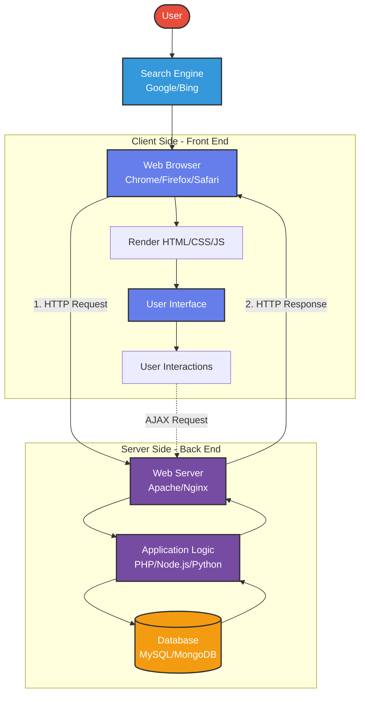

# Front End vs Back End

## Front End (Client Side)
- **Technologies**: HTML, CSS, JavaScript, React, Vue, Angular
- **Responsibilities**:
  - User interface and experience
  - Visual presentation
  - Client-side validation
  - User interactions and events
  - Runs in the user's browser

## Back End (Server Side)
- **Technologies**: PHP, Node.js, Python, Java, Ruby, C#
- **Responsibilities**:
  - Server-side logic
  - Database operations
  - Authentication and security
  - Data processing
  - API endpoints
  - Runs on the server

## Communication
- Front end and back end communicate via **HTTP/HTTPS** protocols
- Data is typically exchanged in **JSON** or **XML** format
- RESTful APIs or GraphQL commonly used for data transfer
