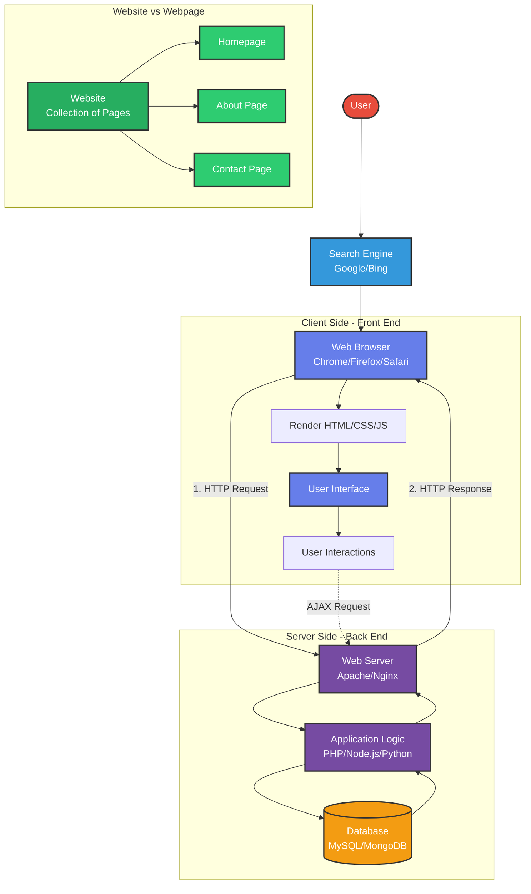

# Front End vs Back End

```mermaid
graph TB
    User([User]) --> SearchEngine[Search Engine<br/>Google/Bing]
    SearchEngine --> Browser[Web Browser<br/>Chrome/Firefox/Safari]
    
    Browser -->|1. HTTP Request| WebServer
    
    subgraph "Website vs Webpage"
        Website[Website<br/>Collection of Pages]
        Website --> Page1[Homepage]
        Website --> Page2[About Page]
        Website --> Page3[Contact Page]
    end
    
    subgraph "Client Side - Front End"
        Browser
        Browser --> Render[Render HTML/CSS/JS]
        Render --> UI[User Interface]
        UI --> Interact[User Interactions]
    end
    
    subgraph "Server Side - Back End"
        WebServer[Web Server<br/>Apache/Nginx]
        WebServer --> App[Application Logic<br/>PHP/Node.js/Python]
        App --> DB[(Database<br/>MySQL/MongoDB)]
        DB --> App
        App --> WebServer
    end
    
    WebServer -->|2. HTTP Response| Browser
    Interact -.->|AJAX Request| WebServer
    
    style User fill:#e74c3c,stroke:#333,stroke-width:2px,color:#fff
    style SearchEngine fill:#3498db,stroke:#333,stroke-width:2px,color:#fff
    style Browser fill:#667eea,stroke:#333,stroke-width:2px,color:#fff
    style UI fill:#667eea,stroke:#333,stroke-width:2px,color:#fff
    style WebServer fill:#764ba2,stroke:#333,stroke-width:2px,color:#fff
    style App fill:#764ba2,stroke:#333,stroke-width:2px,color:#fff
    style DB fill:#f39c12,stroke:#333,stroke-width:2px,color:#fff
    style Website fill:#27ae60,stroke:#333,stroke-width:2px,color:#fff
    style Page1 fill:#2ecc71,stroke:#333,stroke-width:2px,color:#fff
    style Page2 fill:#2ecc71,stroke:#333,stroke-width:2px,color:#fff
    style Page3 fill:#2ecc71,stroke:#333,stroke-width:2px,color:#fff
```
