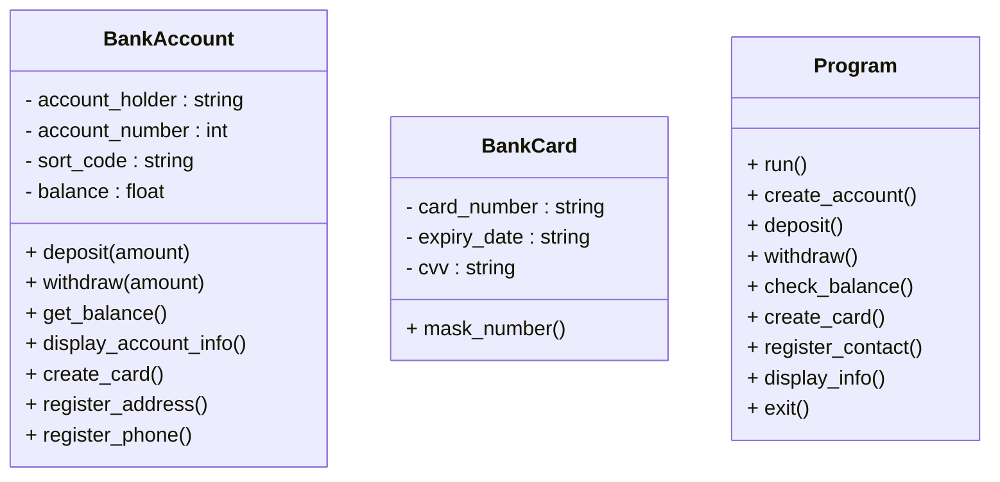
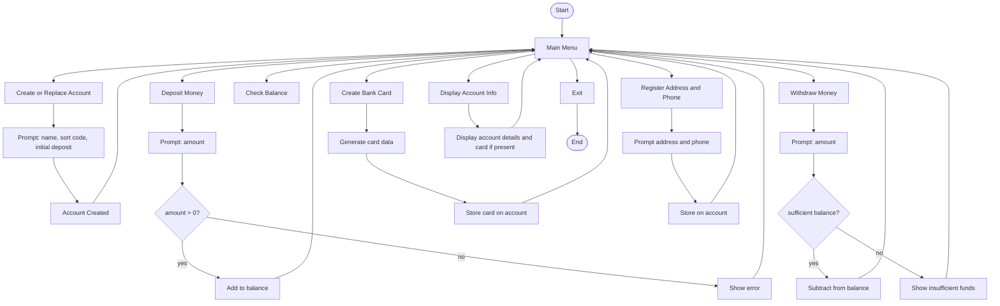
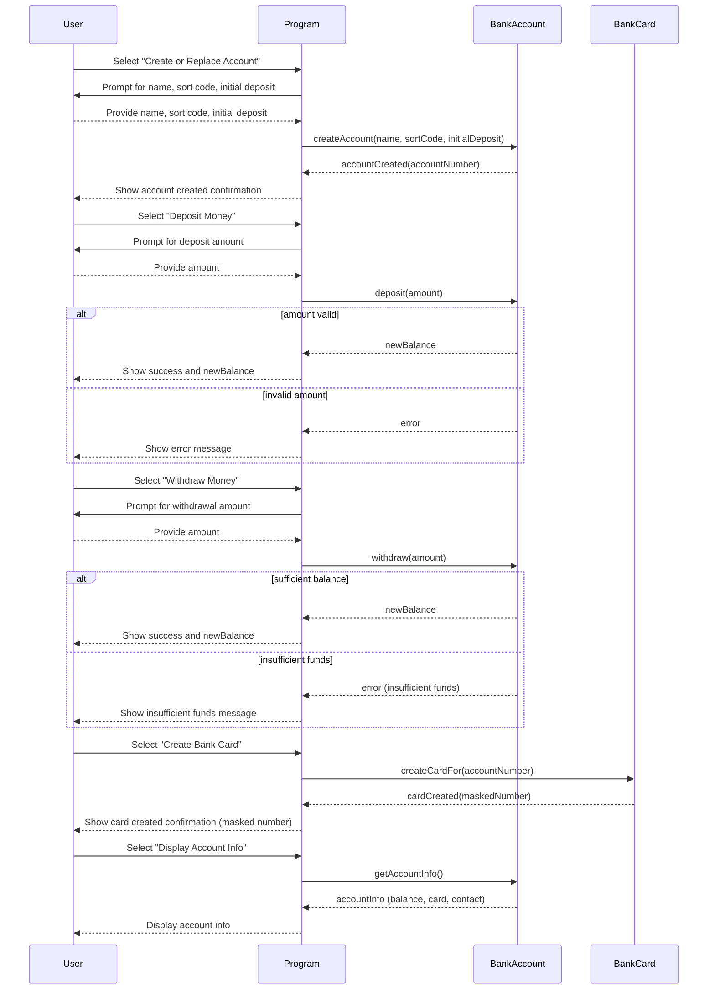

# BankAccount — Diagrams and program flow

This file contains diagrams for a simple bank account program: a class diagram showing main entities and a flowchart describing the program menu and feature flows. The sequence diagram below (recently added) remains unchanged.

## Class diagram (program-focused)

---

### Sequence diagram — Program interaction examples

This sequence diagram shows typical interactions between a user, the program, and domain objects when creating an account, depositing, withdrawing, creating a card and displaying account info.

