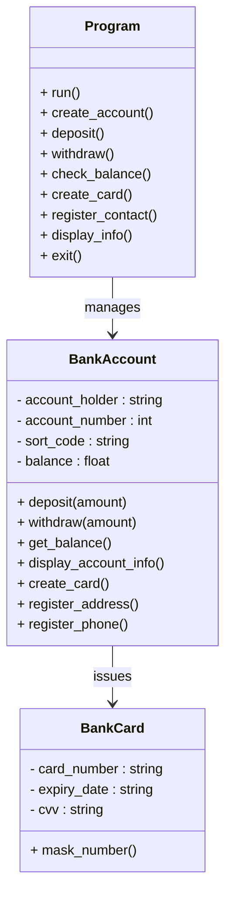

```mermaid
%% Class diagram: program-focused
classDiagram
class BankAccount {
  - account_holder : string
  - account_number : int
  - sort_code : string
  - balance : float
  + deposit(amount)
  + withdraw(amount)
  + get_balance()
  + display_account_info()
  + create_card()
  + register_address()
  + register_phone()
}

class BankCard {
  - card_number : string
  - expiry_date : string
  - cvv : string
  + mask_number()
}

class Program {
  + run()
  + create_account()
  + deposit()
  + withdraw()
  + check_balance()
  + create_card()
  + register_contact()
  + display_info()
  + exit()
}

Program --> BankAccount : manages
BankAccount --> BankCard : issues
```

```mermaid
%% Flowchart: program flow and features
graph TD
  Start([Start]) --> Menu[Main Menu]

  Menu --> Create[Create or Replace Account]
  Menu --> Deposit[Deposit Money]
  Menu --> Withdraw[Withdraw Money]
  Menu --> Balance[Check Balance]
  Menu --> Card[Create Bank Card]
  Menu --> Contact[Register Address and Phone]
  Menu --> Info[Display Account Info]
  Menu --> Exit[Exit]

  Create --> InputCreate[Prompt: name, sort code, initial deposit]
  InputCreate --> AccountCreated[Account Created]
  AccountCreated --> Menu

  Deposit --> PromptDeposit[Prompt: amount]
  PromptDeposit --> ValidateDeposit{amount > 0?}
  ValidateDeposit -- yes --> DoDeposit[Add to balance]
  ValidateDeposit -- no --> DepositError[Show error]
  DoDeposit --> Menu
  DepositError --> Menu

  Withdraw --> PromptWithdraw[Prompt: amount]
  PromptWithdraw --> ValidateWithdraw{sufficient balance?}
  ValidateWithdraw -- yes --> DoWithdraw[Subtract from balance]
  ValidateWithdraw -- no --> WithdrawError[Show insufficient funds]
  DoWithdraw --> Menu
  WithdrawError --> Menu

  Card --> CreateCardPrompt[Generate card data]
  CreateCardPrompt --> CardStored[Store card on account]
  CardStored --> Menu

  Contact --> PromptContact[Prompt address and phone]
  PromptContact --> StoreContact[Store on account]
  StoreContact --> Menu

  Info --> ShowInfo[Display account details and card if present]
  ShowInfo --> Menu

  Exit --> End([End])
```