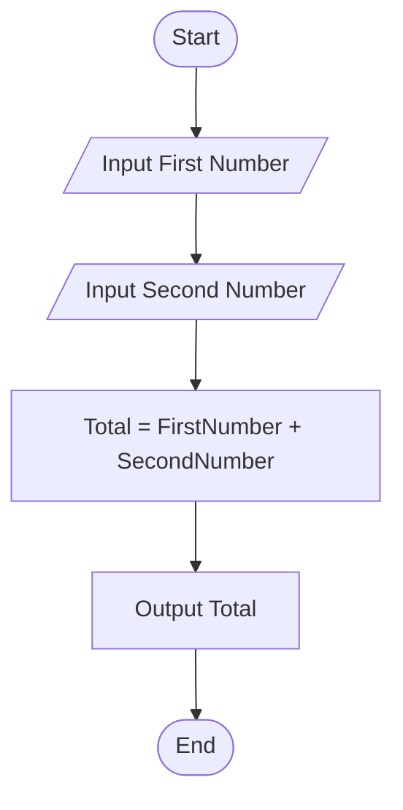
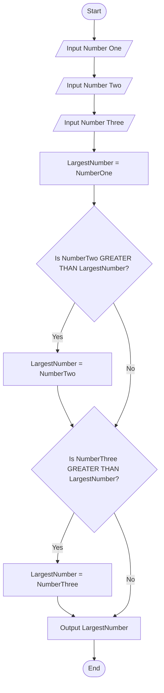
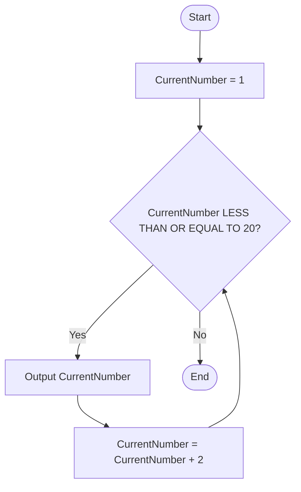
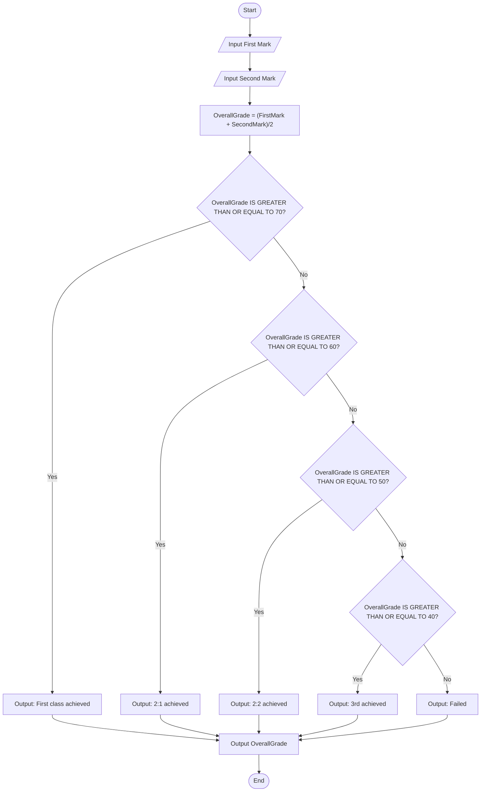

## Activities: Pseudocode and Flowcharts

Below are pseudocode and flowcharts (Mermaid) for the requested scenarios.

### 1) Add two numbers

Pseudocode:

START
INPUT FirstNumber
INPUT SecondNumber
SET Total = FirstNumber + SecondNumber
OUTPUT "Total = " + Total
END



---

### 2) Find the largest number among 3 numbers

Pseudocode:

START
INPUT NumberOne
INPUT NumberTwo
INPUT NumberThree
SET LargestNumber = NumberOne
IF NumberTwo IS GREATER THAN LargestNumber THEN
    SET LargestNumber = NumberTwo
END IF
IF NumberThree IS GREATER THAN LargestNumber THEN
    SET LargestNumber = NumberThree
END IF
OUTPUT "Largest = " + LargestNumber
END



---

### 3) Display only the odd numbers from 1 to 20

Pseudocode:

Approach A (step by 1 and test for odd):
START
SET CurrentNumber = 1
WHILE CurrentNumber LESS THAN OR EQUAL TO 20 DO
  IF CurrentNumber MOD 2 IS EQUAL TO 1 THEN
    OUTPUT CurrentNumber
  END IF
  SET CurrentNumber = CurrentNumber + 1
END WHILE
END

Approach B (step by 2 from the first odd):
START
SET CurrentNumber = 1
WHILE CurrentNumber LESS THAN OR EQUAL TO 20 DO
  OUTPUT CurrentNumber
  SET CurrentNumber = CurrentNumber + 2
END WHILE
END



---

### 4) Calculate grades (two numbers, each worth 50%)

Specification & assumption:
- Each input number is out of 100 and worth 50% of the module.
- Overall grade = (FirstMark + SecondMark) / 2 (i.e., simple average).

Pseudocode:

START
INPUT FirstMark
INPUT SecondMark
SET OverallGrade = (FirstMark + SecondMark) / 2
IF OverallGrade IS GREATER THAN OR EQUAL TO 70 THEN
  OUTPUT "First class achieved"
ELSE IF OverallGrade IS GREATER THAN OR EQUAL TO 60 THEN
  OUTPUT "2:1 achieved"
ELSE IF OverallGrade IS GREATER THAN OR EQUAL TO 50 THEN
  OUTPUT "2:2 achieved"
ELSE IF OverallGrade IS GREATER THAN OR EQUAL TO 40 THEN
  OUTPUT "3rd achieved"
ELSE
  OUTPUT "Failed"
END IF
OUTPUT "Overall grade: " + OverallGrade
END



---

### 5) Calculate an employee's bonus and total bonuses paid by the company

Specification & assumption:
- The program will process multiple employees (one at a time) until the user indicates there are no more employees (for example, by entering a blank name). This lets the program compute a company total bonus.

Bonus rules:
- If TargetsMet IS GREATER THAN OR EQUAL TO 10, bonus = 500
- Else if TargetsMet IS GREATER THAN OR EQUAL TO 5, bonus = 250
- Else bonus = 50

Pseudocode:

START
SET TotalBonus = 0
REPEAT
  INPUT EmployeeName (leave blank to stop)
  IF EmployeeName IS EMPTY THEN
    EXIT REPEAT
  END IF
  INPUT EmployeeID
  INPUT TargetsMet
  IF TargetsMet IS GREATER THAN OR EQUAL TO 10 THEN
    SET Bonus = 500
  ELSE IF TargetsMet IS GREATER THAN OR EQUAL TO 5 THEN
    SET Bonus = 250
  ELSE
    SET Bonus = 50
  END IF
  OUTPUT EmployeeName, EmployeeID, Bonus
  SET TotalBonus = TotalBonus + Bonus
UNTIL false
OUTPUT "Total bonuses paid by company = " + TotalBonus
END

```mermaid
graph TD;
  Start([Start]) --> TotInit["TotalBonus = 0"]
  TotInit --> LoopStart[/Input Employee Name (blank to stop)/]
  LoopStart --> CheckName{"EmployeeName IS EMPTY?"}
  CheckName -- Yes --> ShowTotal["Output TotalBonus"] --> End([End])
  CheckName -- No --> InID[/Input Employee ID/] --> InTargets[/Input Targets Met/]
  InTargets --> D1{"TargetsMet IS GREATER THAN OR EQUAL TO 10?"}
  D1 -- Yes --> B500["Bonus = 500"] --> Add
  D1 -- No --> D2{"TargetsMet IS GREATER THAN OR EQUAL TO 5?"}
  D2 -- Yes --> B250["Bonus = 250"] --> Add
  D2 -- No --> B50["Bonus = 50"] --> Add
  Add["TotalBonus = TotalBonus + Bonus"] --> OutputEmp["Output EmployeeName, EmployeeID, Bonus"]
  OutputEmp --> LoopStart
```

Notes:
- For single-employee runs, the loop can be replaced with a single input/output sequence and TotalBonus = that employee's bonus.
- The pseudocode avoids implementation-specific I/O details so it can be translated into Python, C++, Java, etc.

---

End of activities.
